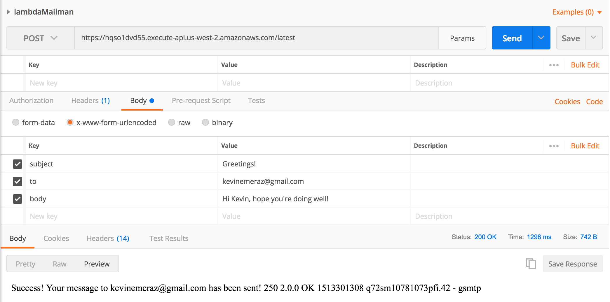

# lambdaMailman

## Overview

Welcome to LambdaMailman! Hit our API to send an email to the recipient of your choice, with the subject and body of your choice.

This repo leverages AWS' API gateway and lambda offerings to provide a serverless architecture.

https://github.com/claudiajs/claudia

ClaudiaJS is used for quick and easy deployment via the command line, allowing an API Gateway to be automatically configured along with the deployment of your Lambda function.

https://github.com/nodemailer/nodemailer

NodeMailer allows us to send an email from a Node server, pre-configured with an arbitrary sender's email address. Here, we've set this configuration via env variables in AWS Lambda.

### Usage
https://hqso1dvd55.execute-api.us-west-2.amazonaws.com/latest

Using LambdaMailman is pretty straightforward. Simply utilize the tool of your choice to make a POST request to the url above (e.g. Postman), with the required params:

url:
```
to: RECIPIENT_OF_YOUR_CHOICE // required

subject: EMAIL_SUBJECT // optional

body: EMAIL_BODY // optional
```


### Installation
If you would like to clone the repo and set up a lambda + gateway instance of your own, you will need:

- An AWS account - https://aws.amazon.com

- AWS CLI - https://aws.amazon.com/cli/ // used for configuring your AWS credentials

- Claudia CLI - https://github.com/claudiajs/claudia // used to deploy and update lambda/gateway

```
git clone https://github.com/kmeraz/lambdaMailman

npm i

Install AWS CLI per your preference and set your credentials

npm i -g claudia

claudia create --region us-west-2 --module-api

Navigate to your lamba function within AWS console and set the USER and PWD env variables to be a gmail address' credentials

Ping your API
```
